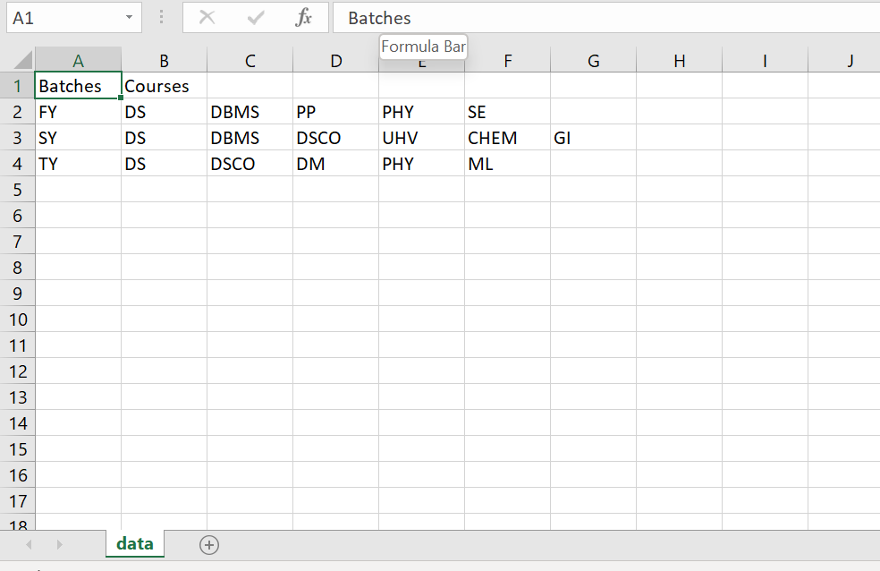
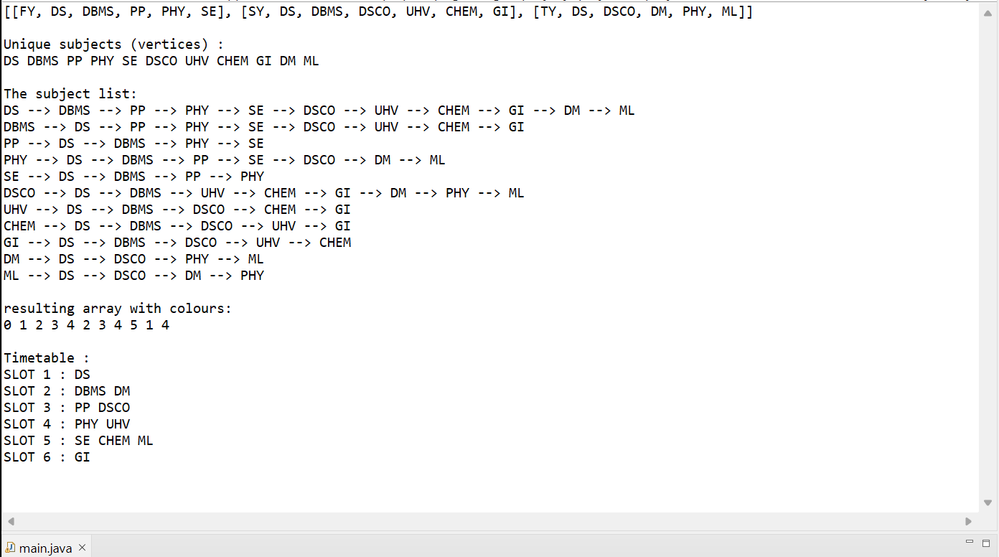

# timetable-generator

# Data Structures course : Mini project
### Exam time-table scheduling using graph coloring algorithm
This program can be used to schedule exams for any university. For testing purposes, we have scheduled exams for all batches from First year till Third year with syllabus taken from Cummins College of Engineering for Women.
---
## Input format
* First line contains labels "Batch" , "Courses" for respective columns.
* "Batch" column contains all batches, for example First Year, Second Year etc.
* "Courses" contains all the courses that exams have to be scheduled for, for the respective batch
---
 
---
## Output
For a complete walkthrough our process, we've displayed the following :
* Data read from CSV file and converted it into an arraylist of arraylists.
* Vertices of resulting graph
* Resulting graph created
* Colour of each vertex after applying graph coloring
* Finally, the resulting time-table for exam
---

---
## To use this
* Install an IDE which supports JAVA
* Open readfile.java and main.java
* Enter data in a csv file , and copy file path in main.java

## What's next?
* Add more constraints, such as capacity of lecture hall
* Use the same logic for creating a time-table for lectures, adding constraints such as teacher's time preferences, break for students etc
